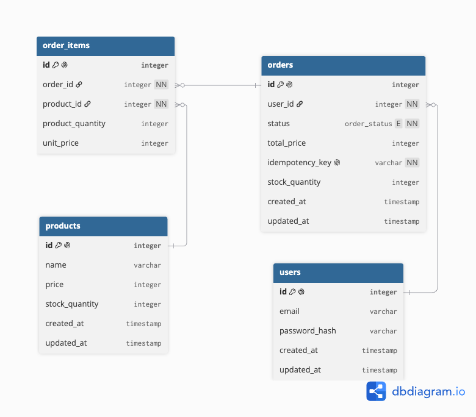

# Task: Concurrent Order & Inventory Reservation Service

[Task Doc link](https://gist.github.com/Dostonlv/553bed161e42a6bcff6bf202d293f372)

A mini marketplace backend built with NestJS.

## Tech Stack

- NestJS, Node.js, TypeScript
- PostgreSQL
- Redis
- JWT, Passport JWT, Bcrypt
- Docker and Docker Compose
- Swagger

## Project Architecture

Layers:

1. **Controller**
2. **Service**
3. **Repository**

## Main Features and Technical Decisions

### 1. Safe Stock Reservation

**Problem:** Many users can buy the same product at the same time. If we have only 10 products but 50 users try to buy them, the system may sell more than 10 without protection.

**Solution:**

- Use `TRANSACTION`
- Lock the product with `SELECT ... FOR UPDATE`.
- Use `CHECK (stock_quantity >= 0)` so stock cannot become negative.

### 2. Idempotency Key

**Problem:** A user may click the order button several times.

**Solution:**

- Every `POST /orders` request has an `Idempotency-Key`.
- Use Redis and `Idempotency-Key` to prevent this

### 3. Product Caching

1. First, check Redis.
2. If the product is in Redis, return it.
3. If it is not in Redis, get it from PostgreSQL.
4. When a product changes, remove its old data from Redis

### 4. Automatic Order Cancellation

We use `@nestjs/schedule` to run a job every minute.

1. Finds `pending` orders older than 15 minutes
2. Changes their status to `cancelled`

## Order Statuses

| Status      | Meaning             |
| ----------- | ------------------- |
| `pending`   | waiting for payment |
| `confirmed` | confirmed           |
| `cancelled` | cancelled           |

## Database Schema

[Schema link](./db-structure/db-structure.md)

- A user can have many orders.
- An order can have many order items.
- Each order item refers to one product and stores its quantity and unit price.

---

The `./test.js` file is used to test `Safe Stock Reservation`
